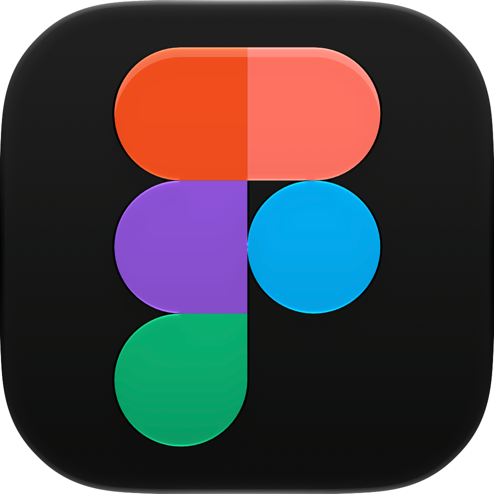
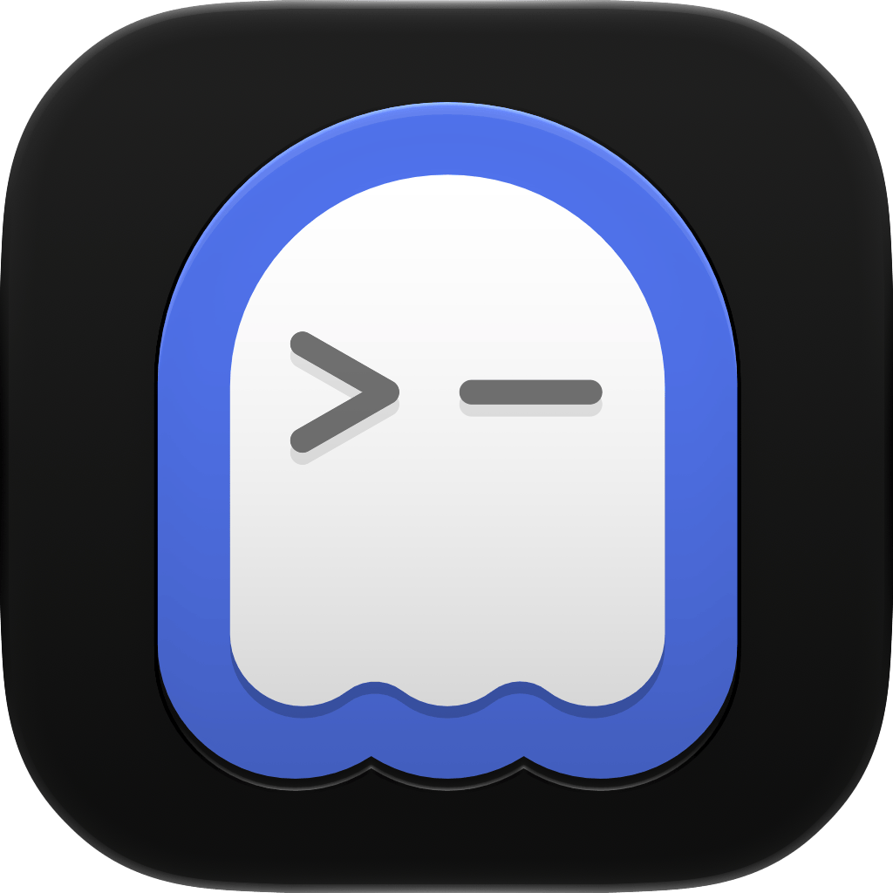
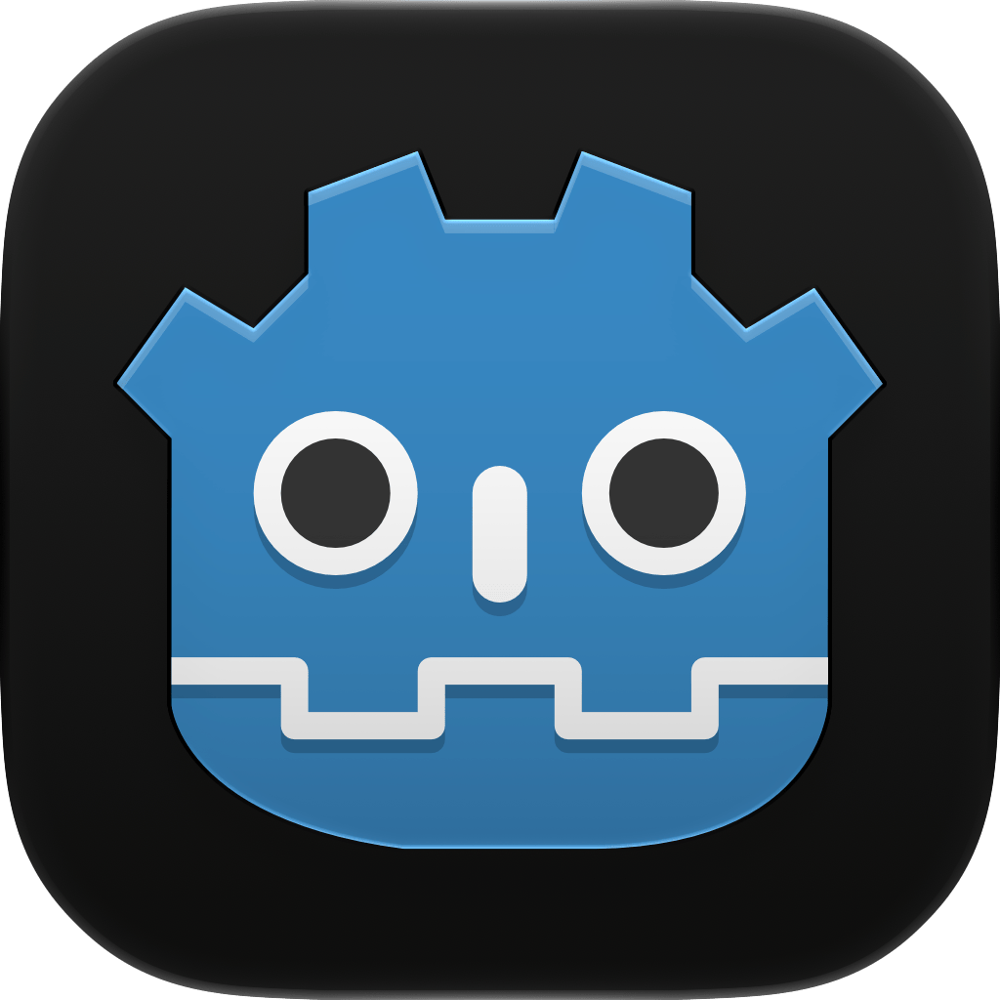
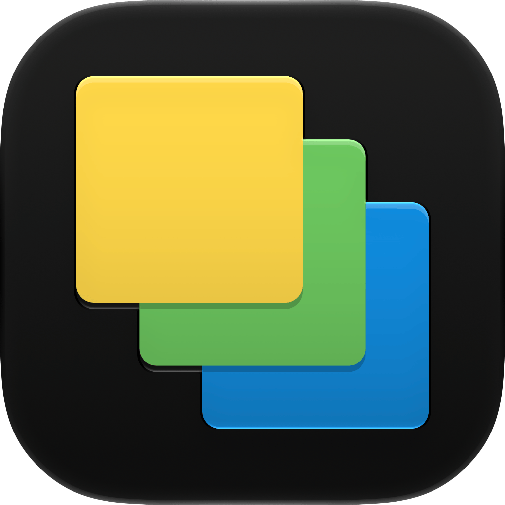
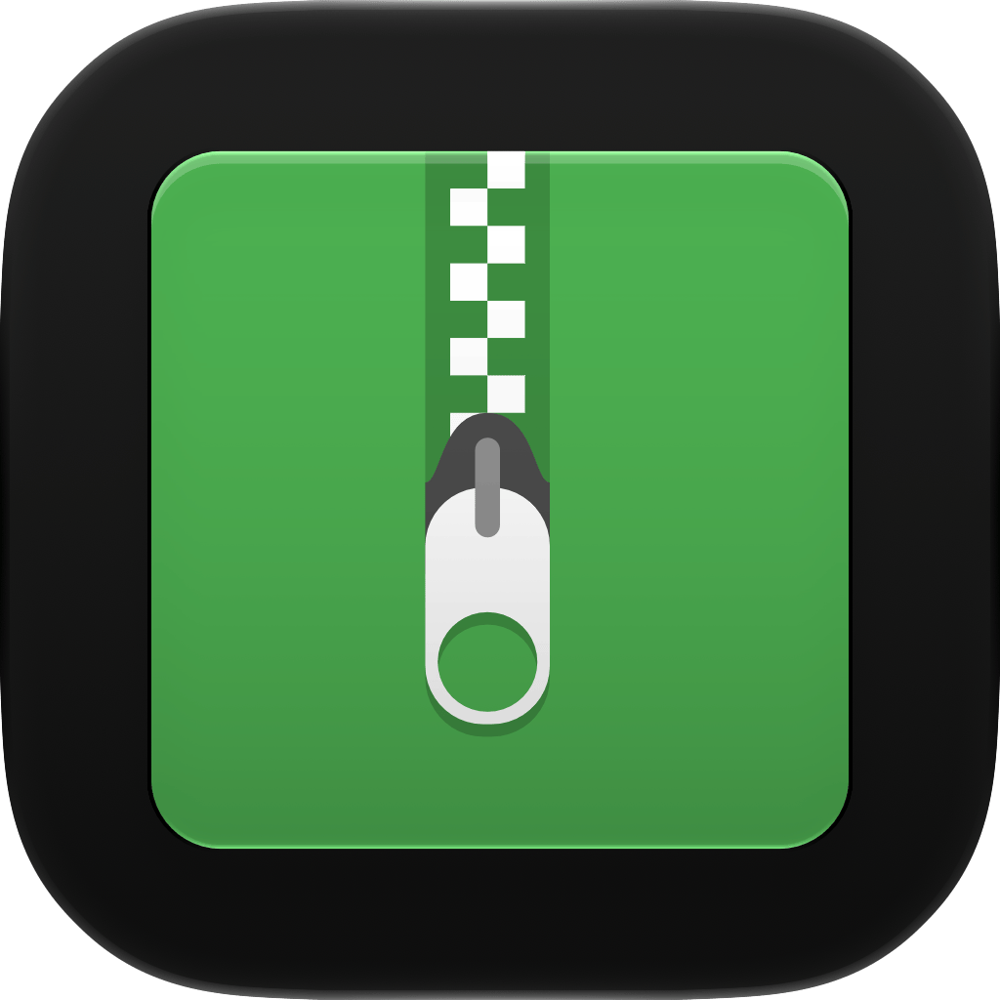
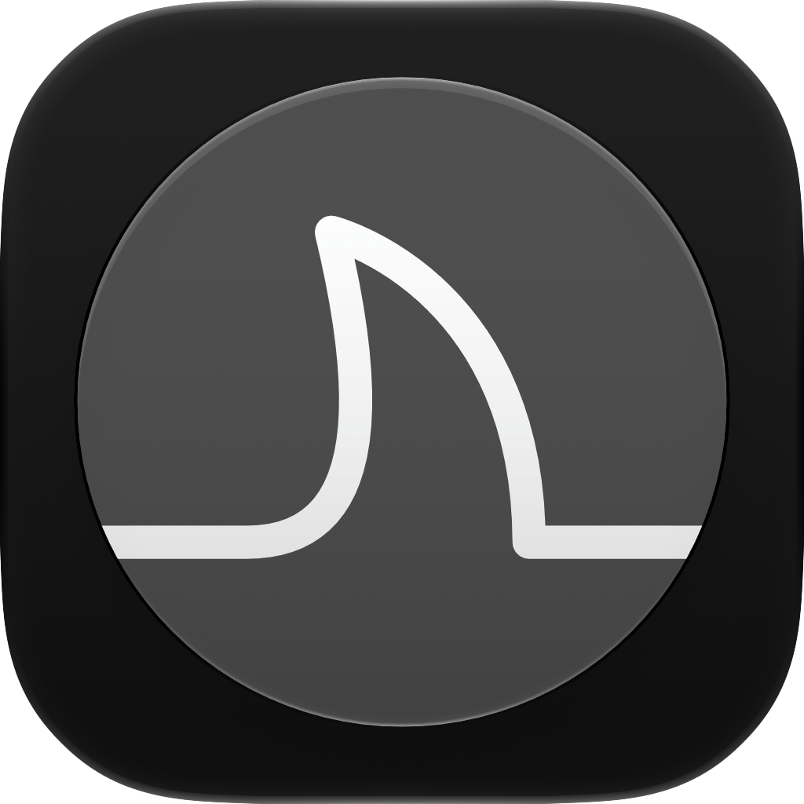
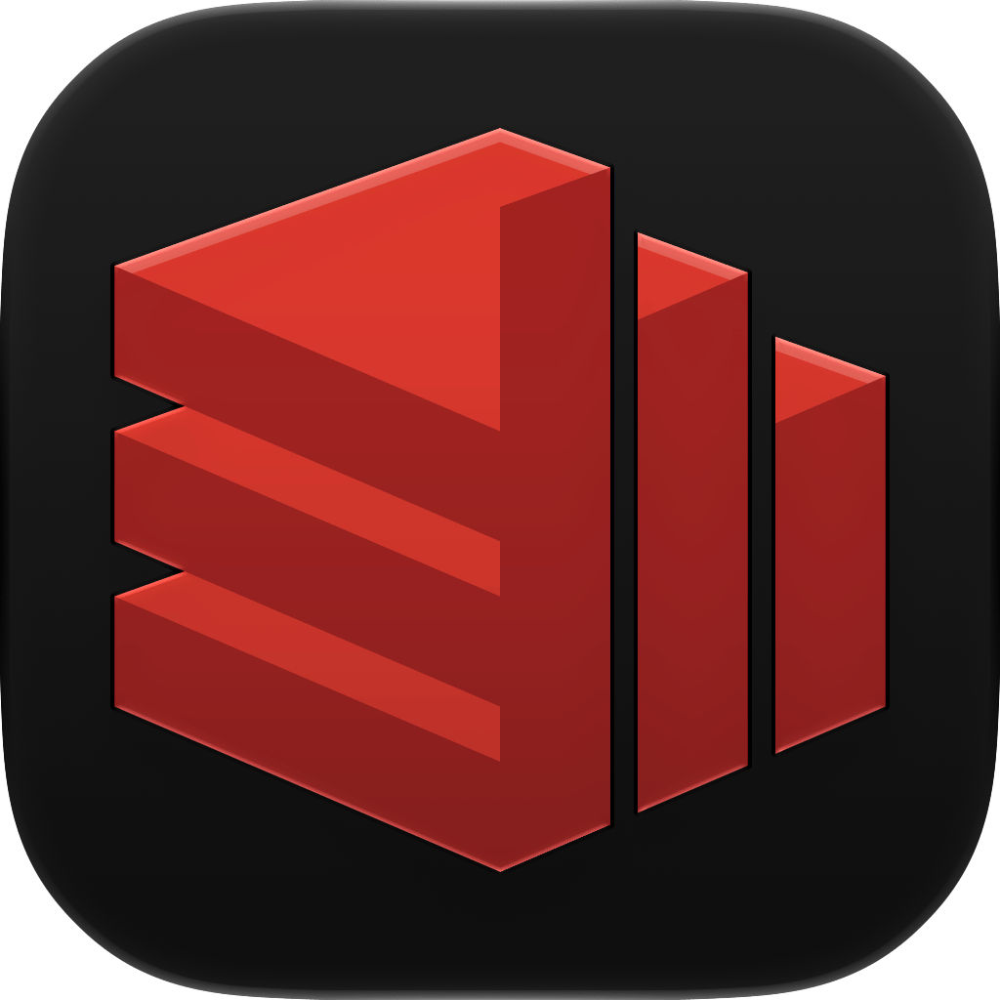
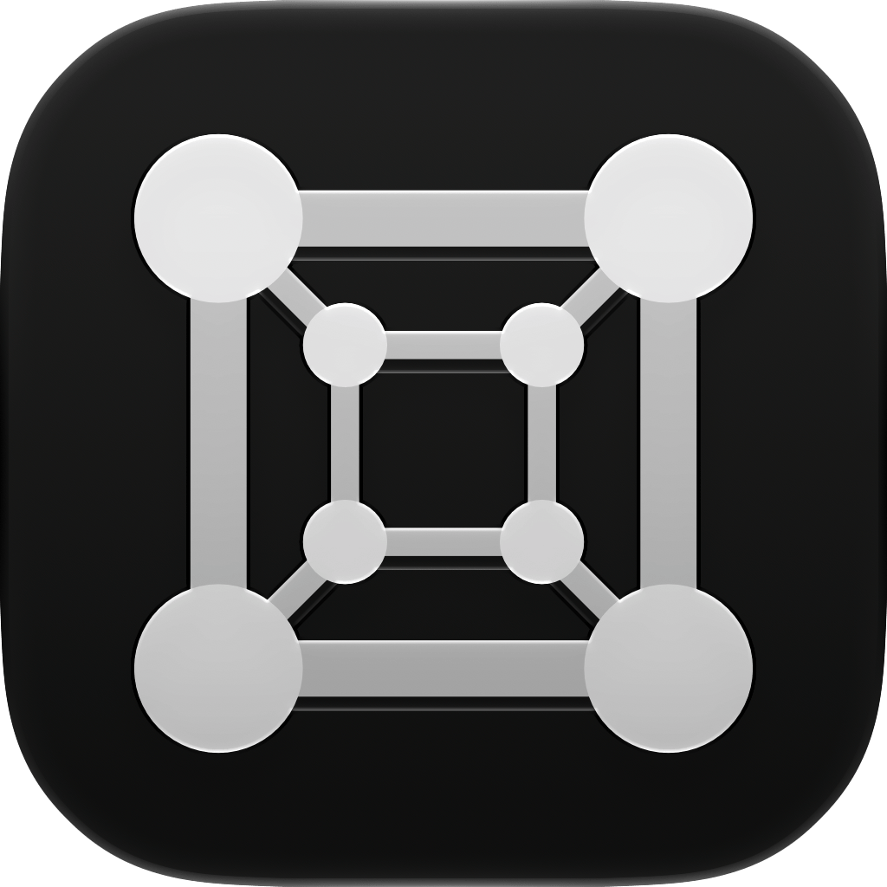
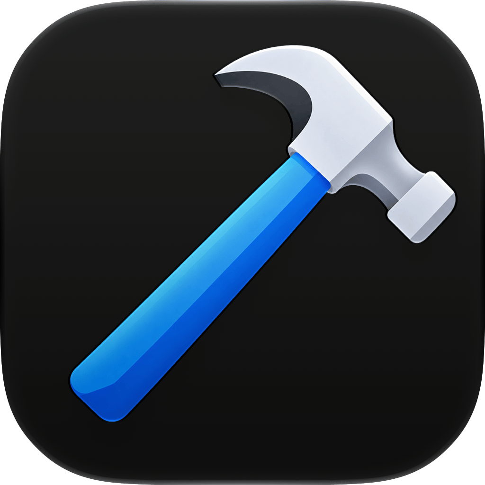

<div align="center">
  <p></p>
  <h1><code>PAPIRIKA</code></h1>
</div>

<table>
  <tbody><tr><td align="center" width="99999"><div>
    <a href="https://olankens.com">WEBSITE</a>
  </div></td></tr></tbody>
  <tbody><tr><td align="center" width="99999">&nbsp;<div>
    ...
  </div>&nbsp;</td></tr></tbody>
  <tbody><tr><td align="center" width="99999">
    <a href="https://apple.com/os/macos"></a>
    <picture></picture>
    <a href="https://figma.com"></a>
    <picture></picture>
    <a href="https://wikipedia.org/wiki/Bash_(Unix_shell)"></a>
  </td></tr></tbody>
</table>

## PREVIEWS

<table><tbody><tr><td width="99999">
  
</td></tr></tbody></table>

## FEATURES

<!-- START_BLOCK -->
<table><tbody><tr><td align="center" width="99999">&nbsp;<div><a href="source/android-studio-preview/android-studio-preview.icns"></a></div>&nbsp;</td><td align="center" width="99999">&nbsp;<div><a href="source/android-studio/android-studio.icns"></a></div>&nbsp;</td><td align="center" width="99999">&nbsp;<div><a href="source/calibre/calibre.icns"></a></div>&nbsp;</td><td align="center" width="99999">&nbsp;<div><a href="source/chromium/chromium.icns"></a></div>&nbsp;</td><td align="center" width="99999">&nbsp;<div><a href="source/discord/discord.icns"></a></div>&nbsp;</td><td align="center" width="99999">&nbsp;<div><a href="source/figma/figma.icns"></a></div>&nbsp;</td><td align="center" width="99999">&nbsp;<div><a href="source/gamehub/gamehub.icns"></a></div>&nbsp;</td></tr></tbody><tbody><tr><td align="center" width="99999">&nbsp;<div><a href="source/ghostty/ghostty.icns"></a></div>&nbsp;</td><td align="center" width="99999">&nbsp;<div><a href="source/godot/godot.icns"></a></div>&nbsp;</td><td align="center" width="99999">&nbsp;<div><a href="source/icon-composer/icon-composer.icns"></a></div>&nbsp;</td><td align="center" width="99999">&nbsp;<div><a href="source/intellij-idea/intellij-idea.icns"></a></div>&nbsp;</td><td align="center" width="99999">&nbsp;<div><a href="source/jdownloader/jdownloader.icns"></a></div>&nbsp;</td><td align="center" width="99999">&nbsp;<div><a href="source/keepassxc/keepassxc.icns"></a></div>&nbsp;</td><td align="center" width="99999">&nbsp;<div><a href="source/keka/keka.icns"></a></div>&nbsp;</td></tr></tbody><tbody><tr><td align="center" width="99999">&nbsp;<div><a href="source/mpv/mpv.icns"></a></div>&nbsp;</td><td align="center" width="99999">&nbsp;<div><a href="source/notion/notion.icns"></a></div>&nbsp;</td><td align="center" width="99999">&nbsp;<div><a href="source/obs/obs.icns"></a></div>&nbsp;</td><td align="center" width="99999">&nbsp;<div><a href="source/orca/orca.icns"></a></div>&nbsp;</td><td align="center" width="99999">&nbsp;<div><a href="source/postman/postman.icns"></a></div>&nbsp;</td><td align="center" width="99999">&nbsp;<div><a href="source/pycharm/pycharm.icns"></a></div>&nbsp;</td><td align="center" width="99999">&nbsp;<div><a href="source/redisinsight/redisinsight.icns"></a></div>&nbsp;</td></tr></tbody><tbody><tr><td align="center" width="99999">&nbsp;<div><a href="source/telegram/telegram.icns"></a></div>&nbsp;</td><td align="center" width="99999">&nbsp;<div><a href="source/transmission/transmission.icns"></a></div>&nbsp;</td><td align="center" width="99999">&nbsp;<div><a href="source/upscayl/upscayl.icns"></a></div>&nbsp;</td><td align="center" width="99999">&nbsp;<div><a href="source/utm/utm.icns"></a></div>&nbsp;</td><td align="center" width="99999">&nbsp;<div><a href="source/vscode/vscode.icns"></a></div>&nbsp;</td><td align="center" width="99999">&nbsp;<div><a href="source/xcode/xcode.icns"></a></div>&nbsp;</td><td align="center" width="99999">&nbsp;<div><a href="source/youtube-music/youtube-music.icns"></a></div>&nbsp;</td></tr></tbody></table>
<!-- CEASE_BLOCK -->

## LEARNING

### CHANGE APPLICATION ICON

```shell
address="https://github.com/olankens/papirika/raw/refs/heads/main/source/android-studio/android-studio.icns"
picture="$(mktemp -d)/$(basename "$address")"
curl -LA "mozilla/5.0" "$address" -o "$picture"
fileicon set "/Applications/Android Studio.app" "$picture"
```
